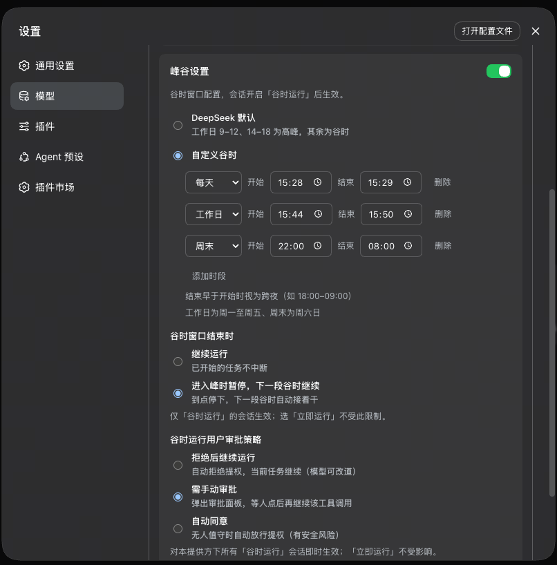

# dsh-offpeak-job 🌙

<p align="center"><a href="README.md"><b>English</b></a> · 简体中文</p>

**DeepSeek Harness 的谷时调度插件**——把对话留到更便宜的时段再跑，峰时可选先停，侧栏里还能一眼看到还在等的任务。

## 📸 截图

| | |
|---|---|
|  | **⚙️ 峰谷设置** —— 按提供方配置：自定义谷时、峰时到了怎么办、夜里挂机时提权怎么处理 |

---

## ✨ 功能导览

### ⚙️ 按提供方配置峰谷

- 入口在 **设置 → 模型** 的每个提供方卡片里
- DeepSeek 可用[官方峰谷](https://api-docs.deepseek.com/zh-cn/quick_start/pricing/)；也可自建多段谷时（每天 / 工作日 / 周末），支持跨夜（如 18:00–09:00）
- 不需要等待时，可整段关掉峰谷
- 可选：**进入峰时暂停，下一段谷时继续**——或让已开跑的任务穿过峰时跑完
- 可选：谷时提权策略——拒绝后继续 / 等你来批 / 自动同意（仅「谷时运行」会话）

### 💬 按会话选择运行时机

- 输入栏控件：**谷时运行** / **立即运行**（样式同访问模式；可在提供方峰谷设置里隐藏）
- 不在谷时窗口里时，消息先排着，会话保持空闲，不会一直转圈
- 等待条上的 **现在开始** 会立刻放出排队任务，但不会把会话改回「立即运行」
- 待发与待续在 Host 重启后仍会保留

### 📋 谷时总览

- 侧栏 Settings 上方的入口（全部提供方都关掉峰谷时会隐藏）
- 跨会话看板：等待谷时、暂停待续、需要你处理、会话不可用
- 有人在等窗口时，可在这里统一 **现在开始** 或放弃

---

## 一览

| | |
|---|------|
| 🧩 插件类型 | Cordis 插件——服务端路由 + Web 客户端，纯增量（不替换任何官方插件） |
| 🌙 管什么 | 「谷时运行」会话的发送准入；可选在窗口结束时暂停 |
| 💬 对话体验 | 会话内等待条；输入栏运行时机控件 |
| 📡 状态看板 | 侧栏谷时总览，角标标出需要留意的项 |
| 💾 状态存储 | `$DSH_HOME/offpeak-job/`（提供方时段、会话开关、待发/待续队列） |
| 🎨 界面 | TypeScript + React（宿主 external）+ CSS，跟宿主观感一致 |

---

## 快速开始

1. **安装**（二选一）：

   **A · 一行命令（推荐）** —— 直接安装 GitHub Release 的安装包，无需 Git：

   ```bash
   dsh plugin --profile web add "https://github.com/ganningniang/dsh-offpeak-job/releases/latest/download/dsh-offpeak-job.tgz"
   ```

   **B · 本地克隆（想改源码用）** —— `link:` 只接受本地绝对路径（路径不要带空格）：

   ```bash
   git clone https://github.com/ganningniang/dsh-offpeak-job.git
   cd dsh-offpeak-job
   npm install && npm run build
   dsh plugin --profile web add "link:<克隆出来的 dsh-offpeak-job 仓库目录的绝对路径>"
   # 例：克隆到 D:\tools 后 → dsh plugin --profile web add "link:D:/tools/dsh-offpeak-job"
   ```

   两种方式 `add` 都会把 `dsh-offpeak-job` 注册进 profile 的 bundle 列表（写入 `~/.dsh`，可能需要授权确认）；若提示找不到 `dsh` 命令，用 `npx @deepseek-ai/dsh` 代替。

2. **重启** DSH web 进程并刷新界面
3. **配置提供方**：**设置 → 模型** → 编辑某提供方 → **峰谷设置** → 选时段 / 结束策略 / 提权策略 → **保存**
4. **在会话里用**：输入栏选 **谷时运行**，正常发送即可——到下一段谷时再跑（等不及就点 **现在开始**）

---

## 架构

一个包同时包含**宿主 Cordis 插件**与 **Web 客户端**：

- **宿主**：`/api/offpeak-job/*` 路由——健康检查、提供方/会话配置、总览、放出 / 放弃 / 续跑冲突处理；在发送路径上拦住「谷时运行」任务，使其可以排队等待而不开成忙碌回合
- **客户端**：注入模型页的峰谷面板、输入栏运行时机、会话等待条、侧栏总览
- **持久化**：时段与排队写在 `$DSH_HOME/offpeak-job/`；Host 重启后恢复队列，并在会话 agent 再次可用时重新挂上到点放出

---

## 开发与测试

```bash
cd dsh-offpeak-job
npm install
npm run build     # lib/index.js + lib/client.js
npm run check
npm run test:offpeak
```

- 请在本包目录内构建——产物是与 `cordis.patch.yml` 同级的 `lib/`
- 测试覆盖时段计算、等待落盘、提权策略、总览与文案冻结

---

## 常见问题

**Q：想重装 / 升到最新版？**

重跑安装命令（永远装最新 Release），装完重启 dsh web 并刷新：

```bash
dsh plugin --profile web add "https://github.com/ganningniang/dsh-offpeak-job/releases/latest/download/dsh-offpeak-job.tgz"
```

排队与峰谷配置在 `$DSH_HOME/offpeak-job/`，重装插件一般不会清掉它们。

**Q：运行时机控件是灰的 / 不见了？**

这个提供方关掉了峰谷（或选了「不限制」），或峰谷面板里关了「会话显示运行时机」。打开峰谷并保存；需要输入栏控件时再打开显示开关。

**Q：到了谷时，任务怎么没跑？**

电脑和 DeepSeek Harness 还得开着。合盖休眠、关掉 web 进程，排队不会自己醒来。重启之后，会话可用时，等待条 / 总览里一般还能看到原来的排队。

**Q：峰时暂停之后，长工具会从断点精确接着吗？**

不会。续跑是下一段谷时「继续这个任务」，不是把工具做到一半的现场完整冻住。你自己点了 **停止**，也不会自动续跑。

---

## 已知限制

- **谷时要真正跑起来，Host 必须还在线**
- 暂停再继续是跟进续跑，不是 mid-tool 断点快照
- 默认提权是 **拒绝后继续**（可按提供方改成等你审批或自动同意）
- 只有 **谷时运行** 会话守日历与谷时提权策略；**立即运行** 走平时流程
- 有待续时又发新消息，会先问你：先完成待续，还是丢掉待续
- 独立插件：不改 DeepSeek Harness 本体；宿主扩展点不够时，在插件内绕过或写明缺口

---

## 隐私

无遥测。配置与排队只落在本机 `$DSH_HOME/offpeak-job/`。除 DeepSeek Harness 本身的模型调用外，本插件不向外部上报。

---

## License

MIT
